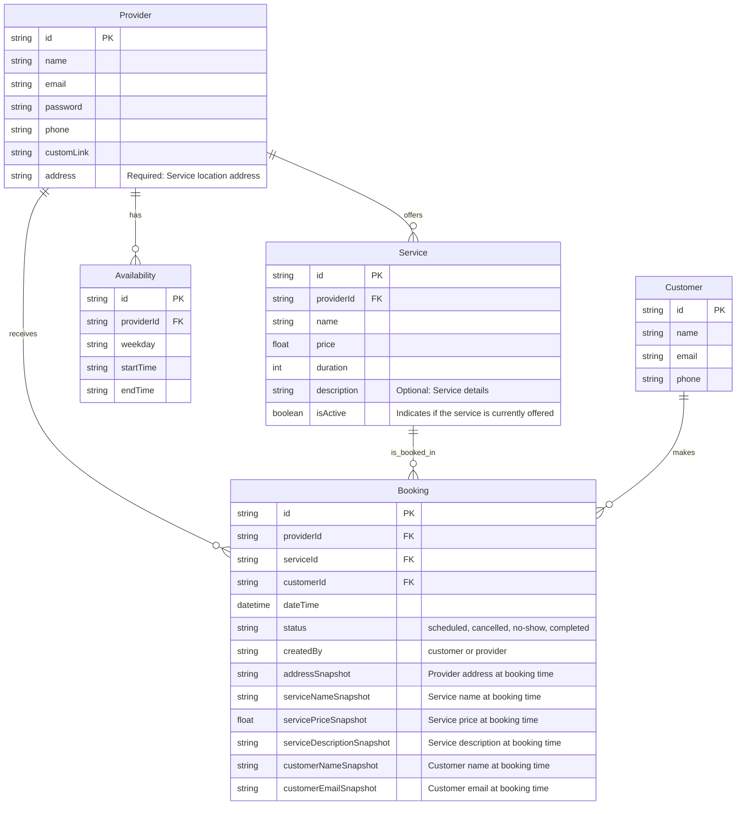
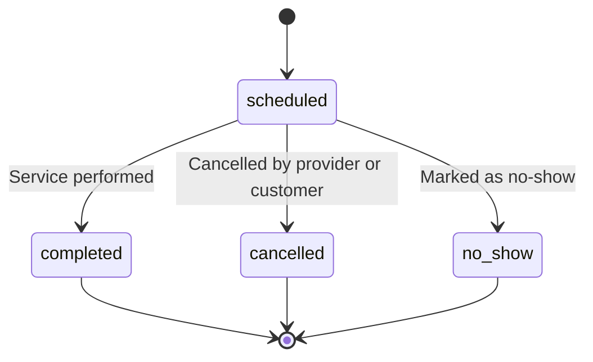

# Documento de Levantamento de Requisitos — Sistema de Agendamento Online para Negócios Locais

---

## 1. Problema Identificado

- Prestadores de serviço têm dificuldade em organizar e visualizar todos os agendamentos em um só lugar.
- Falta de previsibilidade financeira (não saber quanto será faturado no mês).

---

## 2. Justificativa

- Demanda dos próprios prestadores por mais organização e controle financeiro.
- Oportunidade de captar clientes que ainda usam métodos tradicionais (WhatsApp, agenda física).

---

## 3. Objetivos do Projeto

- Centralizar 100% dos agendamentos em um único sistema.
- Facilitar o agendamento para o cliente final, sem necessidade de login.

---

## 4. Escopo

- Apenas versão web, sem app mobile neste momento.
- Funcionalidades focadas em prestador e cliente (sem marketplace ou busca de estabelecimentos).
- Notificações apenas por e-mail (WhatsApp e outros canais ficam para depois).

---

## 5. Requisitos Funcionais

### 5.1. Requisitos para o Prestador de Serviço (com autenticação)

1. O sistema deve permitir que o prestador de serviço acesse a plataforma mediante autenticação por e-mail e senha.
2. O sistema deve disponibilizar um dashboard onde o prestador possa visualizar todos os agendamentos futuros e passados, com filtros por data, status e serviço.
3. O sistema deve permitir ao prestador cadastrar novos agendamentos manualmente, informando cliente, serviço, data, horário e demais dados necessários.
4. O sistema deve permitir ao prestador editar ou cancelar agendamentos existentes, desde que respeitadas as regras de negócio (ex: não permitir edição após o horário agendado).
5. O sistema deve permitir ao prestador marcar um agendamento como "realizado" ou "falta" (no-show).
6. O sistema deve apresentar ao prestador um resumo financeiro mensal, incluindo o total faturado, quantidade de agendamentos realizados, cancelados e ausências.
7. O sistema deve permitir ao prestador cadastrar, editar e remover serviços, informando nome, preço, duração e descrição opcional.
8. O sistema deve permitir ao prestador configurar sua disponibilidade semanal, definindo dias e horários em que aceita agendamentos.
9. O sistema deve permitir ao prestador cadastrar e gerenciar seus dados cadastrais, incluindo endereço obrigatório, telefone e link personalizado para divulgação.
10. O sistema deve enviar uma notificação por e-mail ao prestador sempre que um novo agendamento for realizado por um cliente.
11. O sistema deve enviar uma notificação por e-mail ao prestador em caso de cancelamento de agendamento por parte do cliente.

### 5.2. Requisitos para o Cliente (sem autenticação)

1. O sistema deve permitir que o cliente acesse a página de agendamento do prestador por meio de um link personalizado, sem necessidade de login.
2. O sistema deve exibir ao cliente a lista de serviços disponíveis, com nome, preço, duração e descrição (quando houver).
3. O sistema deve exibir ao cliente um calendário com os dias e horários disponíveis para agendamento, considerando a disponibilidade do prestador e os horários já ocupados.
4. O sistema deve permitir ao cliente selecionar o serviço desejado, data e horário, e preencher um formulário simples com nome, e-mail e telefone.
5. O sistema deve validar os dados do cliente e impedir o agendamento em horários já ocupados ou fora da disponibilidade do prestador.
6. O sistema deve exibir uma mensagem de confirmação ao cliente após o agendamento ser realizado com sucesso.
7. O sistema deve enviar um e-mail de confirmação ao cliente, contendo os detalhes do agendamento (serviço, data, horário, endereço do prestador e informações de contato).
8. O sistema deve enviar um e-mail de lembrete ao cliente próximo ao horário do agendamento.
9. O sistema deve permitir que o cliente cancele um agendamento por meio de link enviado no e-mail de confirmação, respeitando regras de antecedência definidas pelo prestador.

### 5.3. Requisitos de Execução Automática pelo Sistema

1. O sistema deve enviar e-mails automáticos de confirmação, lembrete e cancelamento para clientes e prestadores, conforme os eventos de agendamento.
2. O sistema deve garantir que os dados de agendamento, serviço e endereço sejam registrados em formato de snapshot no momento da criação do agendamento, para garantir histórico consistente mesmo após alterações cadastrais.
3. O sistema deve impedir a criação de agendamentos conflitantes (mesmo horário para o mesmo prestador).
4. O sistema deve registrar logs de todas as operações críticas (criação, edição, cancelamento e status de agendamento) para fins de auditoria.
5. O sistema deve garantir a integridade e segurança dos dados pessoais dos usuários, conforme legislação vigente.

---

## 6. Requisitos Não Funcionais

- Interface responsiva (desktop e mobile).
- Tempo de resposta inferior a 2 segundos nas principais ações.

---

## 7. Critérios de Aceitação

- O prestador consegue visualizar todos os agendamentos do mês em uma única tela.
- O cliente consegue agendar um serviço sem criar conta e recebe e-mail de confirmação.
- O sistema responde em até 2 segundos após o envio de um agendamento.
- O prestador consegue cadastrar um serviço com nome, preço, duração e descrição.

---

## 8. Riscos e Premissas

- Risco de baixa adesão dos prestadores acostumados com métodos tradicionais.
- Premissa de que todos os prestadores têm acesso à internet e e-mail.

---

## 9. Modelagem dos Dados

- Entidades principais: `Provider`, `Service`, `Booking`, `Customer`, `Availability`.
- Redundância aplicada em `Booking` para garantir histórico consistente.

### Diagrama ER

---

## 10. Fluxo de Estado

- Estados do agendamento: `scheduled`, `completed`, `cancelled`, `no_show`.

### Diagrama de Fluxo de Estado

