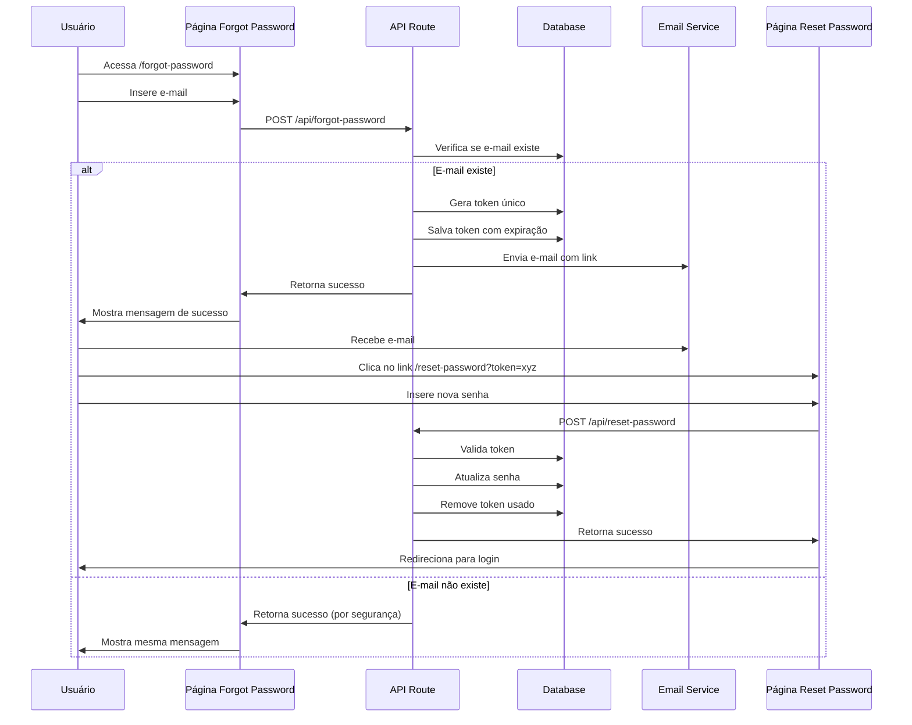

# Plano de Ação — Implementação da Funcionalidade "Esqueci Minha Senha"

## 1. Objetivo
Implementar o fluxo completo de recuperação de senha para prestadores de serviço, permitindo que usuários redefinam suas senhas através de um token seguro enviado por e-mail, seguindo as melhores práticas de segurança e usabilidade.

---

## 2. Levantamento de Requisitos Relacionados
- **Requisito implícito**: Permitir recuperação segura de senha para prestadores cadastrados.
- **Requisito de segurança**: Tokens temporários com expiração para redefinição de senha.
- **Requisito de comunicação**: Envio de e-mails automáticos com link de recuperação.
- **Requisito de usabilidade**: Interface intuitiva e feedback claro ao usuário.
- **Requisito de auditoria**: Registrar tentativas de recuperação para fins de segurança.

---

## 3. Estado Atual do Projeto
- **Auth.js configurado** com provider Credentials em `auth.ts`.
- **Nodemailer disponível** para envio de e-mails (conforme decisões técnicas).
- **Schema Prisma** com tabela `VerificationToken` já existente.
- **Página de login** implementada em `src/app/login/page.tsx`.
- **Componentes UI disponíveis**: Button, Card, Input, Label (shadcn/ui).
- **Sistema de toast** implementado com Sonner para feedback visual.

---

## 4. Arquitetura da Solução

### 4.1. Fluxo de Recuperação de Senha

---

## 5. Etapas do Plano de Ação

### 5.1. Extensão do Schema Prisma
- [ ] **Verificar modelo `VerificationToken`** (já existe no schema):
  - Confirmar campos: `identifier`, `token`, `expires`
  - Este modelo será reutilizado para tokens de recuperação
- [ ] **Adicionar campo opcional** no modelo Provider:
  - `passwordResetAt: DateTime?` para auditoria

### 5.2. Backend (API Routes)

#### 5.2.1. API Route `/api/forgot-password`
- [ ] **Criar `src/app/api/forgot-password/route.ts`**:
  - Validar formato do e-mail
  - Verificar se e-mail existe na base (Provider)
  - Gerar token criptográfico seguro (crypto.randomBytes)
  - Definir expiração do token (1 hora)
  - Salvar token na tabela `VerificationToken`
  - Enviar e-mail com link de recuperação
  - Retornar sempre sucesso (evitar enumeration attack)
  - Implementar rate limiting (max 3 tentativas por hora)

#### 5.2.2. API Route `/api/reset-password`
- [ ] **Criar `src/app/api/reset-password/route.ts`**:
  - Validar token recebido
  - Verificar se token não expirou
  - Validar nova senha (critérios mínimos)
  - Hash da nova senha com bcrypt
  - Atualizar senha no Provider
  - Invalidar token usado
  - Registrar timestamp da alteração
  - Enviar e-mail de confirmação da alteração

### 5.3. Service de E-mail
- [ ] **Criar `src/lib/email-service.ts`**:
  - Configurar templates de e-mail
  - Função `sendPasswordResetEmail(email, token)`
  - Função `sendPasswordChangedEmail(email)`
  - Utilizar Nodemailer com configuração existente
  - Templates responsivos e profissionais

### 5.4. Frontend

#### 5.4.1. Página "Esqueci Minha Senha" (`/forgot-password`)
- [ ] **Criar `src/app/forgot-password/page.tsx`**:
  - Formulário com campo de e-mail
  - Validação client-side
  - Integração com API `/api/forgot-password`
  - Estados de loading e sucesso
  - Link para voltar ao login
  - Design consistente com páginas existentes

#### 5.4.2. Página "Redefinir Senha" (`/reset-password`)
- [ ] **Criar `src/app/reset-password/page.tsx`**:
  - Formulário com campos de nova senha e confirmação
  - Validação de força da senha
  - Parâmetro de query `token` obrigatório
  - Validação do token no frontend
  - Estados de loading, sucesso e erro
  - Redirecionamento automático para login após sucesso
  - Tratamento de tokens inválidos ou expirados

#### 5.4.3. Integração com Página de Login
- [ ] **Atualizar `src/app/login/page.tsx`**:
  - Adicionar link "Esqueci minha senha"
  - Posicionar link abaixo do formulário
  - Estilo consistente com design existente

### 5.5. Utilitários e Validações
- [ ] **Criar `src/lib/password-utils.ts`**:
  - Função de validação de força da senha
  - Geração de tokens seguros
  - Utilities para hash e verificação
- [ ] **Criar `src/lib/rate-limiter.ts`**:
  - Implementar rate limiting simples
  - Controlar tentativas por IP/e-mail

---

## 6. Especificações Técnicas

### 6.1. Segurança
- **Tokens**: Gerados com `crypto.randomBytes(32).toString('hex')`
- **Expiração**: 1 hora (3600 segundos)
- **Hash de senha**: bcryptjs com salt 12
- **Rate limiting**: Máximo 3 tentativas por hora por e-mail
- **Validação de senha**: Mínimo 8 caracteres, incluindo letras e números

### 6.2. Templates de E-mail
- **E-mail de recuperação**:
  - Assunto: "Recuperação de senha - TWBooking"
  - Link: `${process.env.NEXTAUTH_URL}/reset-password?token=${token}`
  - Texto explicativo claro
  - Aviso sobre expiração do link
- **E-mail de confirmação**:
  - Assunto: "Senha alterada com sucesso - TWBooking"
  - Confirmação da alteração
  - Orientações de segurança

### 6.3. Validações
- **E-mail**: Formato válido, existência na base
- **Token**: Formato hexadecimal, não expirado, não usado
- **Senha**: Mínimo 8 caracteres, pelo menos 1 letra e 1 número

---

## 7. Checklist de Implementação

### Backend
- [ ] Verificar modelo `VerificationToken` no schema
- [ ] Adicionar campo `passwordResetAt` no modelo Provider
- [ ] Executar migration do Prisma
- [ ] Implementar API route `/api/forgot-password`
- [ ] Implementar API route `/api/reset-password`
- [ ] Criar service de e-mail com templates
- [ ] Implementar utilitários de segurança
- [ ] Implementar rate limiting

### Frontend
- [ ] Criar página `/forgot-password`
- [ ] Criar página `/reset-password`
- [ ] Adicionar link na página de login
- [ ] Implementar validações client-side
- [ ] Testar fluxo completo
- [ ] Garantir responsividade

### Testes e Validação
- [ ] Testar com e-mails válidos e inválidos
- [ ] Testar tokens expirados
- [ ] Testar rate limiting
- [ ] Verificar segurança dos tokens
- [ ] Validar templates de e-mail
- [ ] Testar responsividade em mobile

---

## 8. Considerações de Segurança

### 8.1. Prevenção de Ataques
- **Enumeration Attack**: Sempre retornar sucesso, independente do e-mail existir
- **Brute Force**: Rate limiting por e-mail e IP
- **Token Reuse**: Invalidar token após uso
- **Token Guessing**: Usar tokens criptográficos fortes

### 8.2. Privacidade
- **Logs**: Não registrar senhas ou tokens em logs
- **E-mails**: Não incluir informações sensíveis
- **Auditoria**: Registrar apenas timestamps de alteração

---

## 9. Dependências e Pré-requisitos
- **Nodemailer**: Já disponível no projeto
- **bcryptjs**: Já disponível no projeto
- **Prisma**: Schema atualizado e migration executada
- **shadcn/ui**: Componentes já disponíveis
- **Configuração SMTP**: Mailtrap ou serviço similar configurado

---

## 10. Observações Finais
- Implementar seguindo princípios de segurança por design
- Manter consistência visual com páginas existentes
- Documentar configurações de e-mail necessárias
- Considerar implementação de logs de auditoria para monitoramento
- Esta funcionalidade é crítica para a experiência do usuário e deve ser amplamente testada
